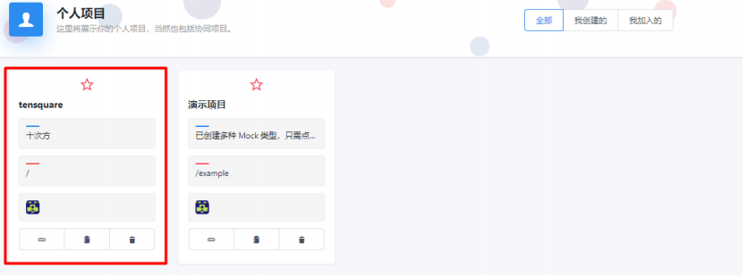

## EasyMock基本使用

### 什么是EasyMock
Easy Mock 是杭州大搜车无线团队出品的一个极其简单、高效、可视化、并且能快速生成模拟数据的 在线 mock 服务 。以项目管理的方式组织 Mock List，能帮助我们更好的管理 Mock 数据。

地址：[https://www.easy-mock.com](https://www.easy-mock.com/)

在线文档：<https://www.easy-mock.com/docs>

### EasyMock基本入门
#### 初始设置

（1）登录或注册。

浏览器打开[https://www.easy-mock.com ](https://www.easy-mock.com/)输出用户名和密码，如果不存在会自动注册。注意：请牢记密码，系统没有找回密码功能！


登录后进入主界面


（2）创建项目：点击右下角的加号

填写项目名称，点击创建按钮


 创建完成后可以在列表中看到刚刚创建的项目

#### 接口操作

（1）创建接口。点击列表中的项目



进入项目工作台页面


点击“创建接口” ,左侧区域输出mock数据，右侧定义Method 、 Url 、描述等信息。


我们可以将我们在Mock.js入门案例中的对象放入左侧的编辑窗口

```json
 {
    'list|1-3': [{  
        'id|+1': 1,
        'name':'@cname',
        'ename':'@last',
        'cfirst':'@cfirst',
        'phone':'@integer',
        'birthday':'@date',
        'pic':'@image',
        'title':'@title',
        'content':'@cword(100)',
        'url':"@url",
        'ip':"@ip",
        'email':"@email",
        'area':'@region',
        'address':'@county(true)'
    }]
}
```

填写url	Method 和描述 ，点击创建按钮

（2）克隆接口和修改接口

​       参照页面点击即可

（3）预览接口和复制接口地址

 	  参照页面点击即可

（4）删除接口

 	  参照页面点击即可

### 导入SwaggerAPI文档
（1）将我们的SwaggerAPI文档扩展名改为yml

（2）在easyMock中点击“设置”选项卡

（3）SwaggerDocs API 选择Upload


（4）将SwaggerAPI文档拖动到上图的虚线区域，点击保存

（5）回到主界面后点击“同步Swagger”

### 本地部署EasyMock(Centos)
将接口放在在线的EasyMock网站中，无形中形成了对该网站的依赖，如果该网站宕机或无法访问，我们的接口也就作废了，所以我们需要将EasyMock本地化，部署到局域网的某台服务器中。

我们将EasyMock本地部署需要将其按照在Centos中，EasyMock使用了Node.js ,MongoDB,Redis，我们需要逐个安装配置，才能实现EasyMock的本地化部署。

#### Centos部署node.js

（1）将node官网下载的 node-v8.11.1-linux-x64.tar.xz 上传至服务器

（2）解压xz文件		

```shell
xz ‐d node‐v8.11.1‐linux‐x64.tar.xz
```

（3）解压tar文件

```shell
tar ‐xvf node‐v8.11.1‐linux‐x64.tar
```

（4）目录重命名

```shell
mv node‐v8.11.1‐linux‐x64 node
```

（5）移动目录到/usr/local下

```shell
mv node /usr/local/
```

（6）配置环境变量

```shell
vi /etc/profile
```

填写以下内容

```shell
#set for nodejs 
export NODE_HOME=/usr/local/node 
export PATH=$NODE_HOME/bin:$PATH
```

执行命令让环境变量生效

```shell
source /etc/profile
```

查看node版本看是否安装成功

```shell
node ‐v
```


#### MongoDB安装与启动

我们使用yum方式安装mongoDb

（1）配置yum

```shell
vi /etc/yum.repos.d/mongodb‐org‐3.2.repo
```

编辑以下内容：

```shell
[mongodb‐org‐3.2] 

name=MongoDB Repository 
baseurl=https://repo.mongodb.org/yum/redhat/$releasever/mongodb‐org/3.2/x86_64/
gpgcheck=1
enabled=1
gpgkey=https://www.mongodb.org/static/pgp/server‐3.2.asc
```

（2）安装MongoDB

```shell
yum install ‐y mongodb‐org
```

（3）启动MongoD

```shell
systemctl start mongod
```

注意启动时是mongd, 不是mongodb

#### Redis安装与启动

（1）下载fedora的epel仓库

```shell
yum install epel‐release
```

（2）下载安装redis

```shell
yum install redis
```

（3）启动redis服务

```shell
systemctl start redis
```

#### 8.3.4 本地部署easy-mock

（1）项目下载地址： <https://github.com/easy-mock/easy-mock>

（2）将easy-mock-dev.zip上传至服务器

（3）安装zip 和unzip

```shell
yum install zip unzip
```

（4）解压

```shell
unzip easy‐mock‐dev.zip
```

（3）进入其目录，安装依赖

```shell
npm install
```

（4）执行构建

```shell
npm run build
```

（5）启动

```shell
npm run start
```

（6）打开浏览器 [http://192.168.184.131:7300](http://192.168.184.131:7300/) 

如果无法访问，需要关闭centos7的防火墙，执行命令如下：

```shell
systemctl stop firewalld.service	
```

然后重新启动EasyMock即可


