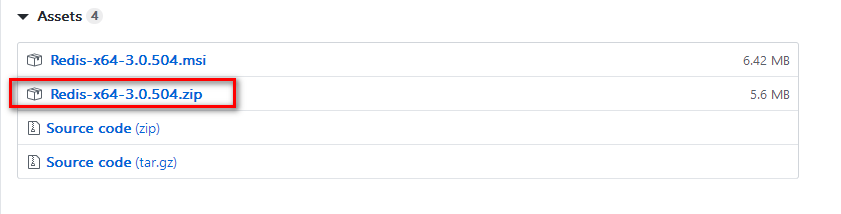

## 本地部署(内网部署)easy-mock
`https://www.jianshu.com/p/a9ac5461bed7`

easy-mock 是常用的mock数据网站， 但是随着用户越来越多，easy-mock的接口响应速度有点时候会很慢(也跟本地网络环境有关)，而且接口也不稳定，时不时就挂了。。。

首先先看easy-mock本地部署的官方介绍，`https://github.com/easy-mock/easy-mock/blob/dev/README.zh-CN.md.官网介绍的步骤`，大致分为以下几步：

* 安装 node（>=v8.9） & MongoDB（>=v3.4） & Redis（>=v4.0）    
* 安装 easy-mock，更改配置文件    
* 启动 easy-mock，测试项目是否可以正常启动，能的话就可以先 Ctrl + C了    
* 启动 MongoDB 和 Redis    
* npm run build，然后用 PM2 启动 app.js   

### 安装步骤
#### 1.先装node
windows直接官网下载exe安装即可

#### 2.安装MongoDB
python笔记中安装过了，直接运行即可

#### 3.安装redis
redis下载链接：https://github.com/MicrosoftArchive/redis/releases
下载64位


将zip压缩包解压到对应的目录

配置环境变量（建议配置，若未配置，可到对应的redis目录下运行）

可直接启动redis服务与客户端连接测试。(我是配置了redis环境变量)

启动服务端命令：
```
redis-server.exe redis.windows.conf
```

连接客户端命令：
```
redis-cli
```

#### 4.安装easy-mock
最后要安装的就是 easy-mock，git clone 下来，然后 npm install，安装依赖，npm run dev启动项目，config/default.json 可以自定义的配置，当然不配置倒也没关系，easy-mock会自动使用 MongoDB 和 redis，不需要其他操作。easy-mock 会默认启动在 7300 下面，打开服务器的ip+port，查看 easy-mock 是否正常启动，正常启动了说明安装阶段大功告成！

自定义配置:在--config下创建local.json文件,
```json
{
  "port": 7300, //easymock项目启动的端口
  "host": "0.0.0.0",
  "pageSize": 30,
  "proxy": false,
  "db": "mongodb://localhost/easy-mock", // 不需要自己新建数据库，在启动的easymock新建接口即可
  "unsplashClientId": "",
  "redis": {
    "port": 6379, //redis端口
    "host": "localhost"
  },
  "blackList": {
    "projects": [], // projectId，例："5a4495e16ef711102113e500"
    "ips": [] // ip，例："127.0.0.1"
  },
  "rateLimit": { // https://github.com/koajs/ratelimit
    "max": 1000,
    "duration": 1000
  },
  "jwt": {
    "expire": "14 days",
    "secret": "shared-secret"
  },
  "upload": {
    "types": [".jpg", ".jpeg", ".png", ".gif", ".json", ".yml", ".yaml"],
    "size": 5242880,
    "dir": "../public/upload",
    "expire": {
      "types": [".json", ".yml", ".yaml"],
      "day": -1
    }
  },
  "fe": {
    "copyright": "",
    "storageNamespace": "easy-mock_",
    "timeout": 25000,
    "publicPath": "/dist/"
  }
}
```

#### 5.部署阶段
全局安装pm2
```
npm install pm2 -g 
```

编译easy-mock文件
```
npm run build
```

启动
```
pm2 start app.js -i 4
```

查看
```
pm2 list
```

访问ip+port
```
http://192.168.1.6:7300
```


